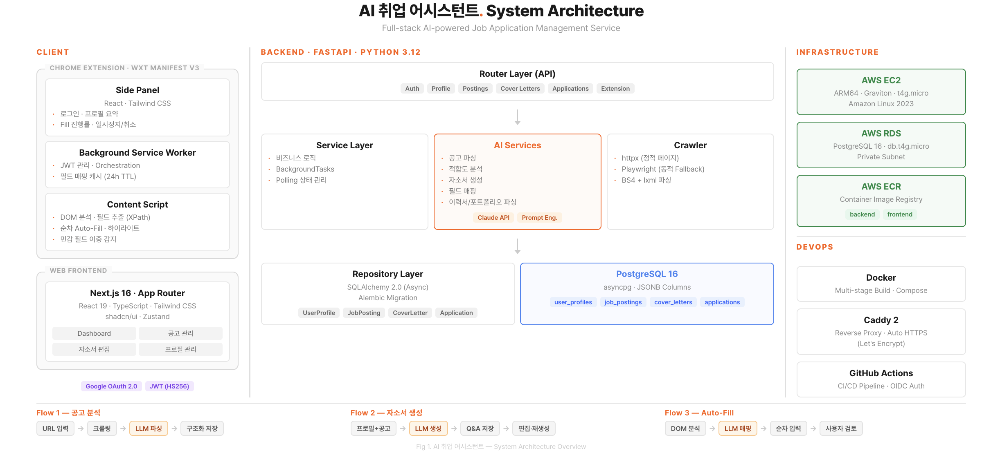

# AI 취업 어시스턴트

> 채용 공고 분석부터 자기소개서 생성, 지원서 자동 작성까지 — AI 기반 취업 지원 관리 서비스

---

## 서비스 소개

**AI 취업 어시스턴트**는 취업 준비 과정에서 반복되는 작업을 자동화하고, AI를 활용해 지원 품질을 높이는 웹 서비스입니다.

채용 공고 URL만 입력하면 공고를 자동으로 크롤링 · 분석하고, 사용자 프로필과 비교하여 적합도를 평가합니다.
이를 기반으로 맞춤형 자기소개서를 생성하며, 크롬 확장 프로그램을 통해 채용 사이트의 지원서 양식까지 자동으로 채울 수 있습니다.

### 주요 기능

| 기능 | 설명 |
|------|------|
| **채용 공고 분석** | URL 입력 시 자동 크롤링 → AI가 회사명, 포지션, 자격요건, 우대사항, 마감일 등 구조화 |
| **적합도 분석** | 사용자 프로필과 공고 요구사항을 비교하여 점수(0~100) · 강점 · 약점 · 준비 전략 제공 |
| **자기소개서 생성** | 공고 + 프로필 기반 맞춤형 자소서 자동 생성, 항목별 재생성 · 편집 가능 |
| **지원 관리** | 지원 상태 추적 (작성 중 → 지원 완료 → 서류 통과 → 면접 → 최종 합격) |
| **대시보드** | 전체 지원 현황 요약, 상태별 필터링, 마감 임박 공고 알림 |
| **프로필 관리** | 학력 · 경력 · 스킬 · 프로젝트 관리, PDF 이력서 업로드 시 AI 자동 파싱 |
| **Auto-Fill (크롬 확장)** | 채용 사이트 지원서 양식을 DOM 분석 → AI 필드 매핑 → 순차 자동 입력 |

---

## 서비스 이용 방법

### 웹 서비스

> **https://apply-manager.duckdns.org/**

1. 위 링크에 접속하여 **Google 계정으로 로그인**합니다.
2. **프로필**에서 학력 · 경력 · 스킬 · 프로젝트 정보를 입력합니다. (PDF 이력서 업로드로 자동 입력도 가능)
3. **공고 관리** 페이지에서 채용 공고 URL을 붙여넣으면 AI가 자동 분석합니다.
4. 분석된 공고 상세 페이지에서 **적합도 분석** 및 **자기소개서 생성**을 이용합니다.
5. **대시보드**에서 전체 지원 현황을 한눈에 관리합니다.

### 크롬 확장 프로그램 (Auto-Fill)

1. 크롬 확장 프로그램을 설치하고 로그인합니다.
2. 채용 사이트의 지원서 작성 페이지를 열고, 공고 상세 페이지에서 **자동 작성** 버튼을 클릭합니다.
3. 확장 프로그램이 지원서 양식을 분석하고, 프로필 · 자소서 데이터를 각 필드에 자동 입력합니다.
4. 입력 과정에서 일시정지 · 재개 · 취소가 가능하며, 민감 정보 필드는 자동으로 건너뜁니다.
5. 모든 입력이 완료되면 **사용자가 직접 검토 후 제출**합니다.

---

## Architecture

### Tech Stack

| 영역 | 기술 |
|------|------|
| **Backend** | Python 3.12, FastAPI, SQLAlchemy 2.0 (Async), Alembic, asyncpg |
| **Frontend** | Next.js 16, React 19, TypeScript, Tailwind CSS, shadcn/ui, Zustand |
| **Database** | PostgreSQL 16 |
| **AI** | Claude API (Anthropic), Prompt Engineering |
| **Crawling** | Playwright, BeautifulSoup4, httpx |
| **Chrome Extension** | WXT (Manifest V3), React, TypeScript |
| **Infra** | AWS (EC2 · RDS · ECR), Docker, Caddy 2, GitHub Actions |
| **Auth** | Google OAuth 2.0, JWT |
